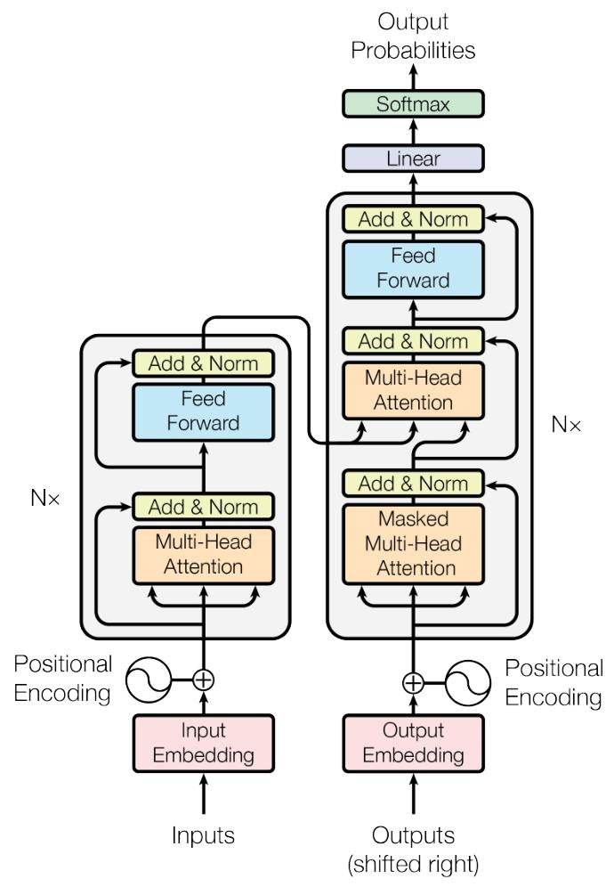

## 2025-11-20 (Day 4): Attention Paper 精读 (Part 1)

### 1. 为什么作者要提出 Transformer? (Introduction)
* **传统模型 (RNN/LSTM) 的痛点：**
    * 计算是顺序的 (Sequential)，必须要等上一个词算完才能算下一个，导致**无法并行计算** (Can't parallelize)，训练太慢。
    * 对于很长的句子，**长距离依赖** (Long-range dependencies) 容易丢失（前面的词忘掉了）。
* **Transformer 的优势：**
    * 抛弃了循环 (Recurrence)，完全基于 **Attention** 机制。
    * 可以**并行计算** (Parallelization)，大大加快了训练速度。

### 2. 模型宏观架构 (Section 3.1)
* **Encoder (编码器)：**
    * 由 `N=6` 个相同的层堆叠而成。
    * 每一层有两个子层：`Multi-Head Self-Attention` 和 `Feed-Forward Network`。
    * 运用了残差连接 (Residual Connection) 和层归一化 (LayerNorm)。
* **Decoder (解码器)：**
    * 也是由 `N=6` 个层堆叠而成。
    * 比 Encoder 多了一个中间层，用来接收 Encoder 的输出。
    * **关键区别：** 第一层的 Attention 是 `Masked` (掩码) 的，这是为了防止模型在预测第 i 个词时“偷看”到后面的词。
    

### 3. 核心英文术语 (我的词汇表)
* `Inductive Bias`: 归纳偏置 (CNN 的偏置是局部性，RNN 是时序性，Transformer 偏置很少)
* `Parallelization`: 并行化
* `Long-range dependencies`: 长距离依赖
* `Masked`: 掩码 (遮住不让看)
